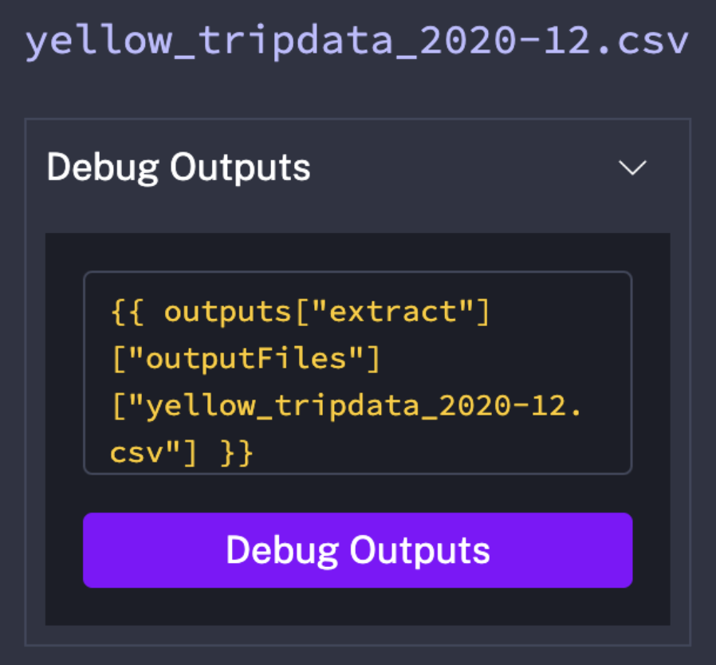

# Module 2 Homework: Workflow Orchestration

## Question 1

Within the execution for `Yellow` Taxi data for the year `2020` and month `12`: what is the uncompressed file size (i.e. the output file `yellow_tripdata_2020-12.csv` of the `extract` task)?
- [x] 128.3 MB
- [ ] 134.5 MB
- [ ] 364.7 MB
- [ ] 692.6 MB

### Solution



## Question 2

What is the rendered value of the variable `file` when the inputs `taxi` is set to `green`, `year` is set to `2020`, and `month` is set to `04` during execution?
- [ ] `{{inputs.taxi}}_tripdata_{{inputs.year}}-{{inputs.month}}.csv` 
- [x] `green_tripdata_2020-04.csv`
- [ ] `green_tripdata_04_2020.csv`
- [ ] `green_tripdata_2020.csv`

### Solution

The Kestra workflows set the following templated variable:

```yml
file: "{{inputs.taxi}}_tripdata_{{trigger.date | date('yyyy-MM')}}.csv"
```

## Question 3

How many rows are there for the `Yellow` Taxi data for all CSV files in the year 2020?
- [ ] 13,537.299
- [x] 24,648,499
- [ ] 18,324,219
- [ ] 29,430,127

### Solution

```sql
SELECT
    COUNT(*)
FROM
    `project_id.taxis_dataset.yellow_tripdata`
WHERE
    filename LIKE 'yellow_tripdata_2020%';
```

## Question 4

How many rows are there for the `Green` Taxi data for all CSV files in the year 2020?
- [ ] 5,327,301
- [ ] 936,199
- [x] 1,734,051
- [ ] 1,342,034

### Solution

```sql
SELECT
    COUNT(*)
FROM
    `project_id.taxis_dataset.green_tripdata`
WHERE
    filename LIKE 'green_tripdata_2020%';
```

## Question 5

How many rows are there for the `Yellow` Taxi data for the March 2021 CSV file?
- [ ] 1,428,092
- [ ] 706,911
- [x] 1,925,152
- [ ] 2,561,031

### Solution

```sql
SELECT
    COUNT(*)
FROM
    `project_id.taxis_dataset.yellow_tripdata`
WHERE
    filename = 'yellow_tripdata_2021-03.csv';
```

## Question 6

How would you configure the timezone to New York in a Schedule trigger?
- [ ] Add a `timezone` property set to `EST` in the `Schedule` trigger configuration  
- [x] Add a `timezone` property set to `America/New_York` in the `Schedule` trigger configuration
- [ ] Add a `timezone` property set to `UTC-5` in the `Schedule` trigger configuration
- [ ] Add a `location` property set to `New_York` in the `Schedule` trigger configuration  


## Submitting the solutions

* Form for submitting: https://courses.datatalks.club/de-zoomcamp-2025/homework/hw2